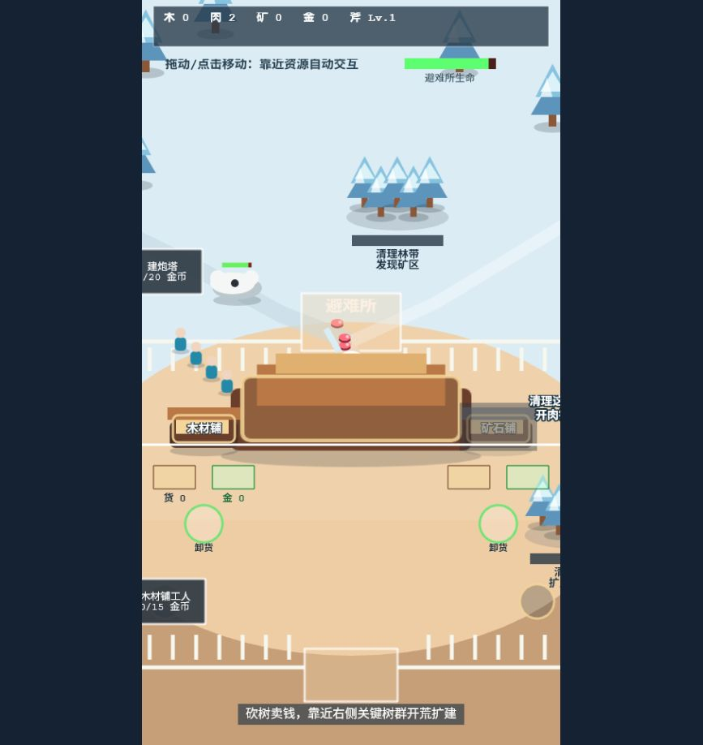
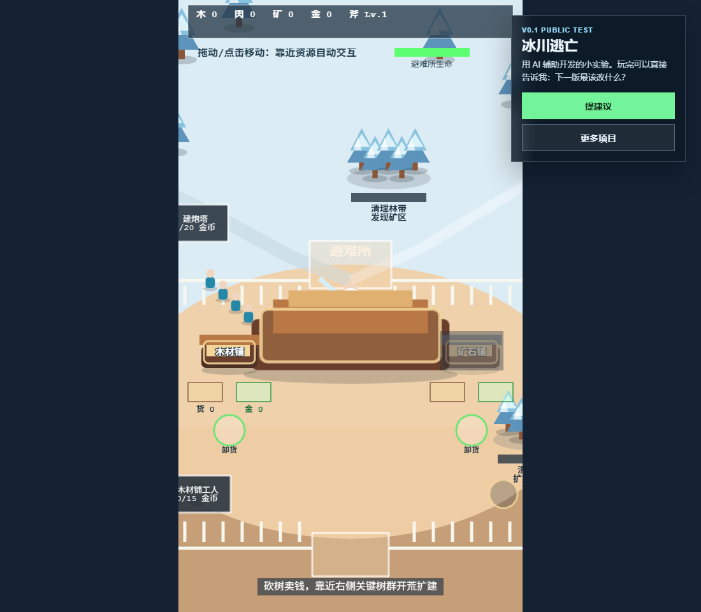

# 冰川逃亡 / Ice Survival Demo

我做了个冰川逃亡小游戏 v0.1。

现在它还很早期，但已经能玩：砍树、捡肉、卖资源、扩建避难所，然后看着熊一点点压过来。欢迎来试玩，也欢迎顺手吐槽一下：哪里槽点多、哪里卡、哪里应该更刺激、下一版最该加什么。

重点是这个反馈表：

<https://my.feishu.cn/share/base/form/shrcnvK0cCnI1zJpEPzrIMZMgcc>

我会从反馈里挑 1-2 条，做进下一版。

This is a tiny public v0.1 browser game. Try it, poke at it, roast the rough parts, and tell me what should become v0.2.

## 在线试玩

- 直接玩：<https://ice.minitechs.xyz/>
- 提建议 / 吐槽入口：<https://my.feishu.cn/share/base/form/shrcnvK0cCnI1zJpEPzrIMZMgcc>
- MiniTechs 主页：<https://www.minitechs.xyz/>

游戏页面里也有“提建议”按钮。桌面端在画面旁边，手机端在底部。

## 现在长这样



页面里的“提建议”入口是这轮实验的核心：玩完不用写长评，直接点进去说一句也行。



## 怎么玩

- 鼠标点击哪里，角色就往哪里走。
- 鼠标按住拖动，也可以持续改变移动方向。
- 手机上可以直接触屏点按 / 拖动控制。
- 靠近树、肉、矿石会自动收集。
- 靠近店铺会自动卸货、卖资源。
- 靠近扩建点会自动投入金币。
- 熊会往避难所方向靠近，别让局面太快崩掉。

一句话：点哪走哪，靠近东西就自动干活。

## 这不是成品

它现在不是一个“正式上线大作”，更像一个公开小实验：

1. 先把粗糙但能玩的 v0.1 放出来。
2. 让大家直接玩、直接吐槽、直接提点子。
3. 挑 1-2 条建议做成 v0.2。
4. 再把改动过程发出来。

如果你想看更离谱一点的玩法，比如熊更凶、资源搬运更爽、失败动画更夸张、角色更聪明，都可以往问卷里扔。

## 后面想试什么

- 让反馈真的进入 v0.2，而不是停在“谢谢建议”。
- 加一点更强的冲突感，比如更明确的熊群压力和失败反馈。
- 试试把 AI 放进来，让角色自己找资源、躲危险、做决策。
- 往沙盒观察方向靠一点：不是只让玩家操作，也能看 AI 小人在里面自己折腾。

## 本地运行

```bash
npm install
npm run dev
```

打开：

```text
http://127.0.0.1:5173/
```

宣传录制模式：

```text
http://127.0.0.1:5173/?mode=promo
```

`?mode=promo` 只是用来录展示素材，不是普通试玩入口。

## 常用命令

```bash
npm test
npm run build
```
